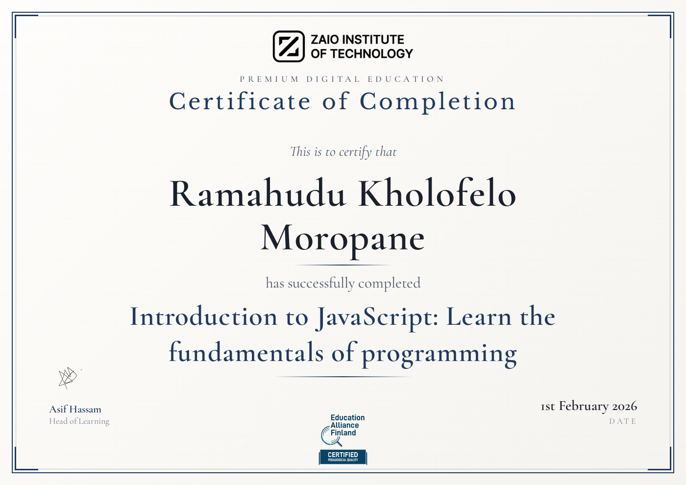

# Introduction to JavaScript: Learn the fundamentals of programming

## What I actually learnt:

- Some cool history about JavaScript

- Variables & Some basic important stuff to know in JS

- More details on different Types & dealing with conditionals

- Using Functions

- Using Objects

- Arrays & Sets

- Classes

- The DOM

- Building Google Keep

- Async Javascript

- Github API project

### Summary

- I will knw all the important things in Javascript, not everything, but whatever is needed for me to get started.

- This sets up a good foundation for me to go ahead and learn ReactJS, AngularJS, VueJS etc.

- I will have also built 2 real world apps in this course, and gotten a good amount of practice!

### Certificate:

